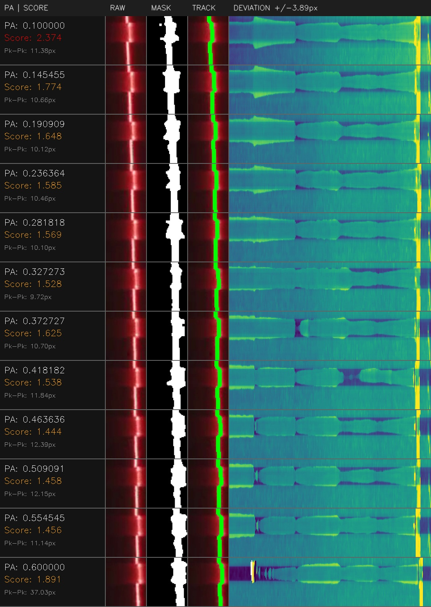
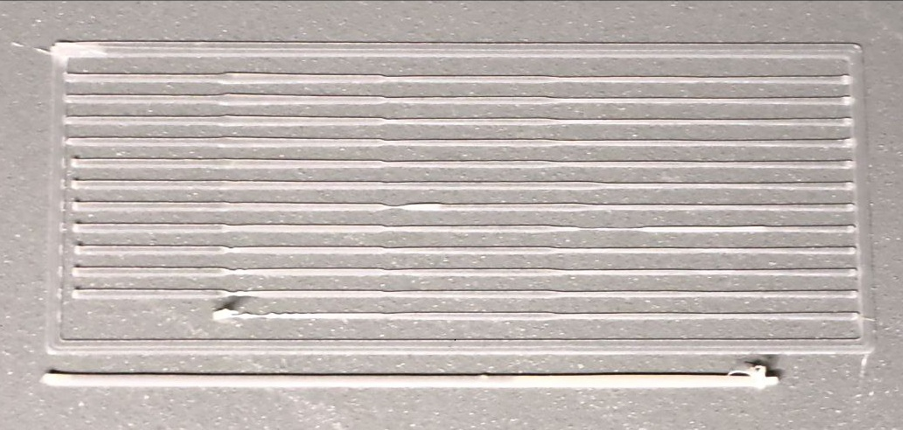

# Rubidium

Rubidium is a Klipper extension for printing and scanning pressure advance test patterns

It provides a framework to:
- generate and print test patterns
- "run them over" as scans or prints
- record video of that
- analyze the results


### Patterns
The template, basically something with settings assigned a name

### Modes: scan vs print

Rubidium distinguishes between different modes:

- **Scan mode**  
  Used for recording video of the patterns

- **Print mode**  
  Used for printing the patterns

Both modes use the same underlying pattern definitions.


## Video capture

Rubidium records video during a scan using `ffmpeg`.

right now:
- a continuous session video is recorded
- motion events emit timestamped markers
- markers and metadata are written to a JSON file
- per-segment video clips are generated

## Example configured pattern and its results:

```
[rubidium pattern multistep]
origin_x:         100
origin_y:         100

layer_height:     0.25

line_length:      70
line_spacing:     2

pattern_segments:
    medium:         0.2,
    scv:            0.2,
    medium:         0.2,
    fast:           0.2,
    medium_slow:    0.2

param_start:      0.1
param_stop:       0.6
param_count:      12

tuning_command:   SET_PRESSURE_ADVANCE
tuning_parameter: OFFSET
```

<div style="display:flex; gap:12px;">
  
  
</div>

---

## Install
To install this plugin, run the installation script using the following command over SSH. 
```
wget -O - https://raw.githubusercontent.com/Contomo/rubidium/main/install.sh | bash
```
This script will download this GitHub repository to your RaspberryPi home directory, and symlink the files in the Klipper extra folder.

> Note that you may need to install cv2, numpy, and or matplotlib into your klippy env if you havent already.


## Status

Rubidium is an active work in progress.

---

Inspired by [Rubedo](<https://github.com/furrysalamander/rubedo>)  
